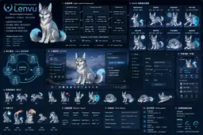

# NorthPalace-my-pet

**Lenvu — local-first Neralune digital companion for Windows.**

NorthPalace-my-pet is a lightweight desktop-pet and local AI companion designed first for **Windows 11 / Ryzen 3 2200G / 16 GB DRAM / Vega 8**. Lenvu is meant to feel like a persistent digital lifeform on the desktop, not a chat window wearing a mascot skin.



> **Product north star:** the original overview above defines the intended product shape: a foreground desktop companion, low-noise interaction, focus support, memory, local AI as an optional cognition layer, and deep management kept outside the ambient pet experience.

## Non-negotiable acceptance rule

Unload every AI worker completely.

Lenvu must still be able to move, idle, observe, sleep/wake, react to petting and play, enter Focus Guard, preserve long-lived state, expose inspectable local memory and perform ordinary desktop interaction. AI may add cognition later; it is not the animation controller and it is not the source of life.

## Current development baseline

The repository is currently a **living desktop-pet / Persistent Life foundation**, not a release candidate and not yet the final visual product.

Implemented today:

- Rust-owned monotonic Pet Runtime with a 250 ms semantic tick;
- parallel Pet State for locomotion, facing, posture, attention, emotion, mode and cognition;
- Behavior Intent priority/TTL/interruption instead of one exclusive activity state;
- deterministic weighted ambient personality selection without an LLM;
- Windows idle/return, local hour and privacy-gated foreground-app awareness;
- opt-in bounded Windows UI Automation metadata with no element text/tree dump;
- native work-area movement, facing, drag/pick-up/drop and selective transparent click-through;
- deliberate horizontal multi-monitor exploration for ambient `Explore` only;
- separate transparent `pet` and independent `companion` windows;
- event-driven runtime snapshot and pet display-context synchronization across WebViews without independent background UI polling;
- system tray and opt-in Windows launch-at-login;
- bundled SQLite persistence, schema migrations, activity/relationship history, FTS5 memory and hourly rhythm;
- Memory Browser/editor, Activity and Privacy/Settings surfaces;
- source-measured Lenvu visual ground-truth / canonical landmark pipeline.

Not implemented yet:

- production canonical Lenvu master artwork and sprite/atlas animation graph;
- final canonical application icon and high-resolution README/reference derivatives;
- Memory Evaluator and deeper long-term relationship/personality evolution;
- local text-model worker / llama.cpp / MiniCPM5-1B runtime;
- optional screen-pixel vision worker;
- target-machine performance baseline and release packaging hardening.

## Architecture

```text
Windows 11
│
├─ Tauri 2 desktop process
│  ├─ Rust Pet Runtime
│  │  ├─ monotonic clock
│  │  ├─ Domain Event channel
│  │  ├─ PetBrainV2
│  │  ├─ weighted personality policy
│  │  └─ immutable RuntimeSnapshot
│  │
│  ├─ Windows adapters
│  │  ├─ idle / return
│  │  ├─ local hour
│  │  ├─ foreground app + privacy-approved bounds
│  │  ├─ opt-in bounded accessibility metadata
│  │  ├─ monitor / DPI / work area
│  │  ├─ selective cursor passthrough
│  │  └─ native pet-window movement / drag
│  │
│  ├─ PrivacyPolicyService + ScreenContextBroker
│  │
│  ├─ Persistent Life
│  │  ├─ SQLite + WAL
│  │  ├─ pet state
│  │  ├─ activity / relationship history
│  │  ├─ typed memories + FTS5
│  │  └─ hourly interaction rhythm
│  │
│  └─ WebView windows
│     ├─ pet       → PixiJS presentation
│     └─ companion → Svelte management UI
│
├─ Lenvu presentation contract
│  ├─ src/lib/pet/lenvu.manifest.json   ← single runtime manifest source
│  ├─ semantic animation resolver
│  ├─ facing-aware semantic hit zones
│  └─ PixiJS renderer
│
└─ Optional AI workers [planned]
   ├─ text   → llama.cpp / MiniCPM5-1B GGUF
   └─ vision → separately loadable, on-demand only
```

The Domain layer does not depend on Svelte, PixiJS, Tauri window coordinates, Win32, SQLite or llama.cpp. Sensors publish facts; privacy gates decide whether sensitive context may cross the boundary; Pet Brain interprets allowed facts; platform controllers perform validated side effects; presentation renders snapshots.

## Pet behavior

The ordinary life loop is intentionally independent of AI:

```text
Observe → Interpret → React → Remember → Bond → Evolve
```

Current reflex/life behavior includes idle, observe, sit, lie, sleep, wake, touch, petting, play, Focus Guard, pick-up/drag/drop and weighted ambient exploration. Sleeping restores energy and reduces sleep pressure; awake time slowly consumes energy and raises sleep pressure.

Movement is a native window side effect driven from semantic locomotion state. The motion controller seeds direction from domain `facing`, respects the current Windows work area, reverses at edges, and only allows autonomous monitor transitions for `Explore` across genuinely adjacent horizontal displays.

## Renderer and Lenvu identity

The current PixiJS character remains a **procedural engineering placeholder**. It exists to validate runtime state, animation resolution, power policy, semantic hit zones and window behavior before production assets are ready.

Lenvu has asymmetric identity features, including heterochromia and the left-side gold crescent ornament. Blind whole-character horizontal mirroring is therefore forbidden. The placeholder mirrors only symmetric geometry and semantically repositions identity-bearing features; production assets must use directional artwork or equivalent semantic remapping.

The only authoritative renderer manifest is:

```text
src/lib/pet/lenvu.manifest.json
```

Reference art, source measurements, canonical master metadata and runtime animation assets remain separate products. The original source evidence outranks generated candidates, inferred coordinates and assistant memory.

See `docs/LENVU_VISUAL_GROUND_TRUTH.md`, `docs/CANONICAL_LENVU.md`, `docs/CANONICAL_LANDMARKS.md` and `docs/ASSET_PIPELINE.md`.

## Privacy and screen context

Privacy is enforced at the Windows sensor boundary, not merely hidden in the UI.

`PrivacyPolicyService` starts fail-closed. Per-app exclusions are stored locally in `privacy-rules.json`. Foreground identity is limited to the executable stem; window titles are not collected by default. Visible DWM bounds are queried only after the app identity passes the privacy gate.

Accessibility context is separately opt-in. It reads only bounded focused-control structural metadata such as control type, enabled/focus/offscreen/password flags and bounds. It does not read Name, Value, HelpText, raw text, screenshots or accessibility-tree dumps. The UI Automation reader unloads when the capability is disabled and retries initialization after transient failures.

Privacy-rule updates are written to a flushed temporary file and replaced through the Windows replace-existing/write-through path so an existing rule file is never intentionally removed before the replacement is ready.

## Persistent life and memory

`lenvu.sqlite3` lives under the application's local-data directory. Database work is isolated from ordinary Pet Brain ticks.

Current schema areas:

```text
pet_state
activity_journal
relationship_events
memories
memory_fts
rhythm_hourly
```

The activity journal is intentionally bounded and ignores high-frequency noise. Long-term memory currently supports episodic, semantic, preference and relationship records with FTS5/BM25 retrieval plus importance/recency metadata. A future Memory Evaluator will decide whether automatic candidates should be stored, merged or discarded.

If persistence cannot initialize, Lenvu continues session-only instead of failing the whole pet runtime.

## UI/UX layers

1. **Ambient** — Lenvu exists without conventional UI.
2. **Direct interaction** — hover, touch, pet, play and drag are reflex-layer actions with no AI call.
3. **Context bubble** — short, low-noise state/reaction cues.
4. **Companion** — Home, Memory, Activity and Settings.
5. **Deep management / debug** — model, privacy, performance and developer diagnostics should remain outside the ambient experience.

Opening the Companion is intentionally separated from petting: the small `☾` handle and system tray open the panel; double-clicking Lenvu is not used as a second hidden command path.

## Validation

Current Windows CI validates the source on `main` with:

- Lenvu asset-contract validation as part of the frontend production build;
- Rust formatting check;
- Rust Clippy with warnings treated as errors;
- Rust/Tauri unit tests on Windows.

The repository still needs dependency lockfiles before builds can be considered fully reproducible. CI also does not replace a clean executable/bundle test and RAM/CPU/GPU measurement on the actual Ryzen 3 2200G target machine.

## Next engineering sequence

```text
Consolidation
  ↓
common worker lifecycle / supervision
  ↓
reproducible dependency locks
  ↓
canonical Lenvu production master
  ↓
Idle / Walk / Sit / Sleep production assets
  ↓
PixiJS sprite/atlas renderer
  ↓
target-machine build + performance baseline
  ↓
Memory Evaluator / relationship evolution
  ↓
MiniCPM5-1B isolated text worker
```

Do not expand the visual-policy/measurement layer further unless source evidence exposes a concrete missing contract. The current guardrails are sufficient; the next visual work should produce assets.

## Repository layout

```text
NorthPalace-my-pet/
├─ .github/workflows/      Windows CI
├─ assets/
│  ├─ reference/           source/reference character material
│  └─ runtime/             canonical/runtime asset work area
├─ docs/                   architecture and product contracts
├─ public/                 UI-served static resources
├─ scripts/                asset validation
├─ src/                    Svelte + PixiJS presentation
├─ src-tauri/              Rust runtime, persistence and Windows integration
├─ README.md
├─ package.json
└─ vite.config.ts
```

## Documentation authority

When documents disagree, use this maintenance order:

```text
running code / tests
        ↓
docs/ARCHITECTURE.md
        ↓
docs/ROADMAP.md
        ↓
README summary
```

Visual identity is a separate exception: original source evidence and `docs/LENVU_VISUAL_GROUND_TRUTH.md` remain authoritative over generated candidates and renderer placeholders.
